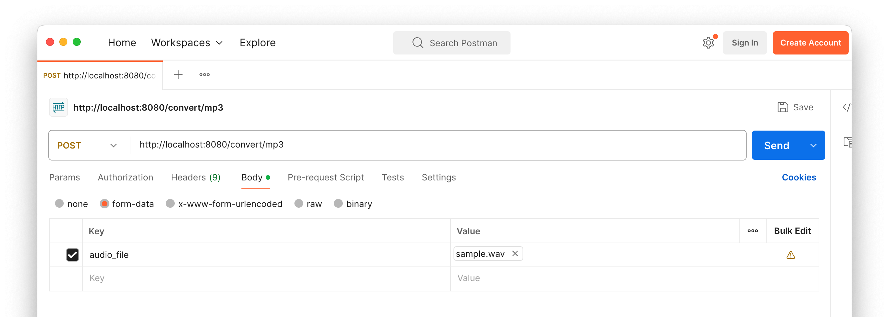

# Convert an Audio File to Another Format With PHP and FFMpeg


## Prerequisites/Requirements

To run the code, you will need the following:

- PHP 8.3 (or above, if later versions are stable)
- [Composer](https://getcomposer.org) installed globally
- [Docker Desktop](https://www.docker.com/products/docker-desktop/)
- A network testing tool such as [curl](https://curl.se/) or [Postman](https://www.postman.com/)
- FFMpeg globally installed

## Application Overview 

This is a small PHP application that shows how to convert audio files to a limited number of other audio file formats.
The application supports an upcoming tutorial on [the Twilio blog](https://www.twilio.com/en-us/blog).

The app's has a single route, that supports POST requests, and is defined as: `/convert/{to_format}`. 
`{to_format}` can be one of `aac`, `flac`, or `mp3` as the project, currently, only supports converting to [AAC](https://docs.fileformat.com/audio/aac/), [FLAC](https://docs.fileformat.com/audio/flac/), and [MP3](https://docs.fileformat.com/audio/mp3/) formats.

The route looks for an audio file in the POST request data, in a variable named `audio_file`.
If found, it converts it to the format specified by `{to_format}`.

**Note:** the uploaded audio must be in a format supported by your FFMpeg installation.
To view the list of supported formats, run the following command:

```bash
ffmpeg -formats
```

## How to use the application

### Start the application

To run the project, you can either use Composer or the included Docker Compose configuration.

```bash
# Start the project with Composer
composer serve

# Start the project with Docker Compose
docker compose up -d
```

### Convert an audio file

Once up and running, use a network testing tool such as curl or Postman to make a POST request to the default route.

#### Convert an audio file using Curl

To convert an audio file using curl, use the example below, using curl:

```bash
curl \
  --form "audio_file=@resources/audio/sample.mp3" \
  --output sample.flac \
  http://localhost:8080/convert/flac
```

The example above posts the sample MP3 file that accompanies the project, converting it to FLAC format.

#### Convert an audio file using Postman

Alternatively, you could use Postman, if you prefer a GUI.



Set the request type to `POST`.
Then, under **Body**, set the request type to `form-data`.
After that, add a key named `audio_file`, set its type to `File`, then chose _sample.mp3_ file in the _resources/audio_ directory, or use an audio file of your choice.
Finally, click **Send** to make the request.

If the request is successful, you'll see an audio control in the response's body section, which you can then listen to and confirm that the file has been successfully converted.

[aac_format_url]: https://docs.fileformat.com/audio/aac/
[flac_format_url]: https://docs.fileformat.com/audio/flac/
[mp3_format_url]: https://docs.fileformat.com/audio/mp3/